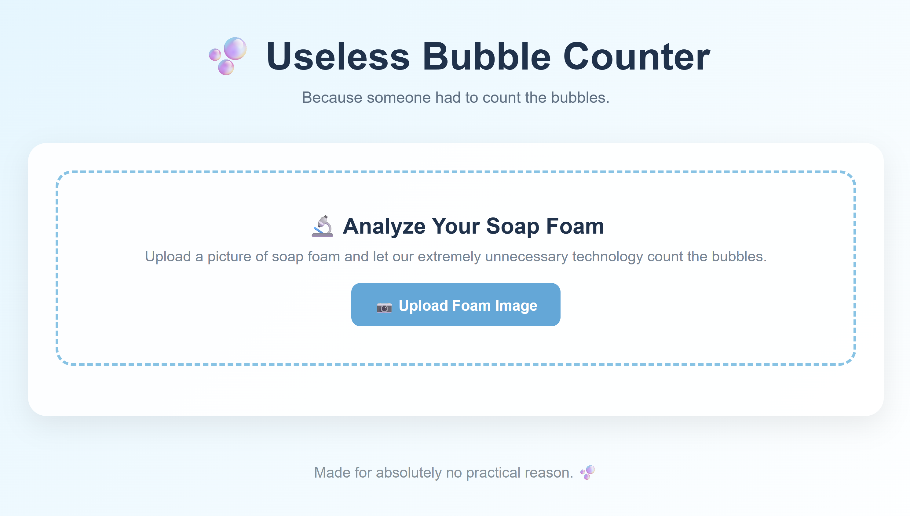
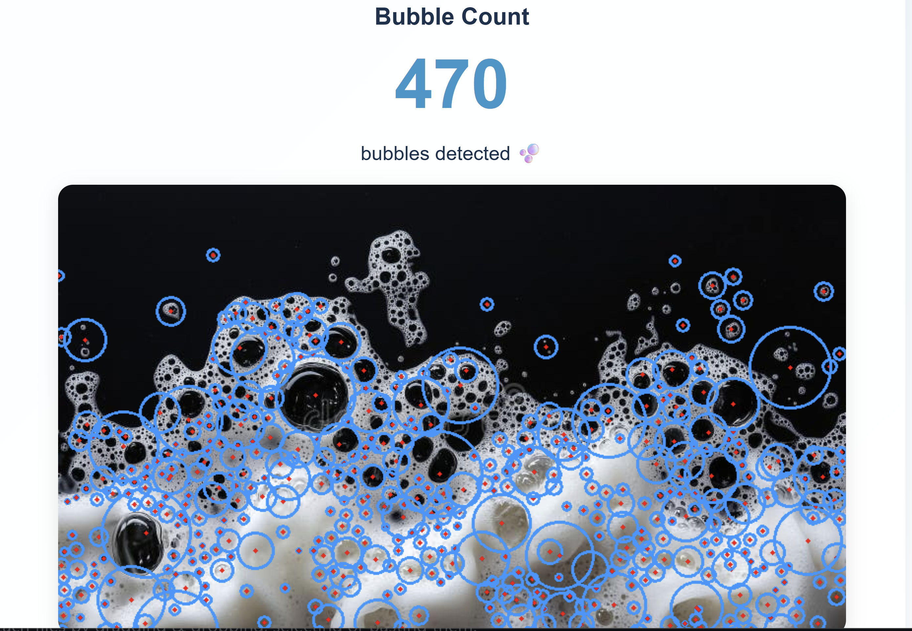
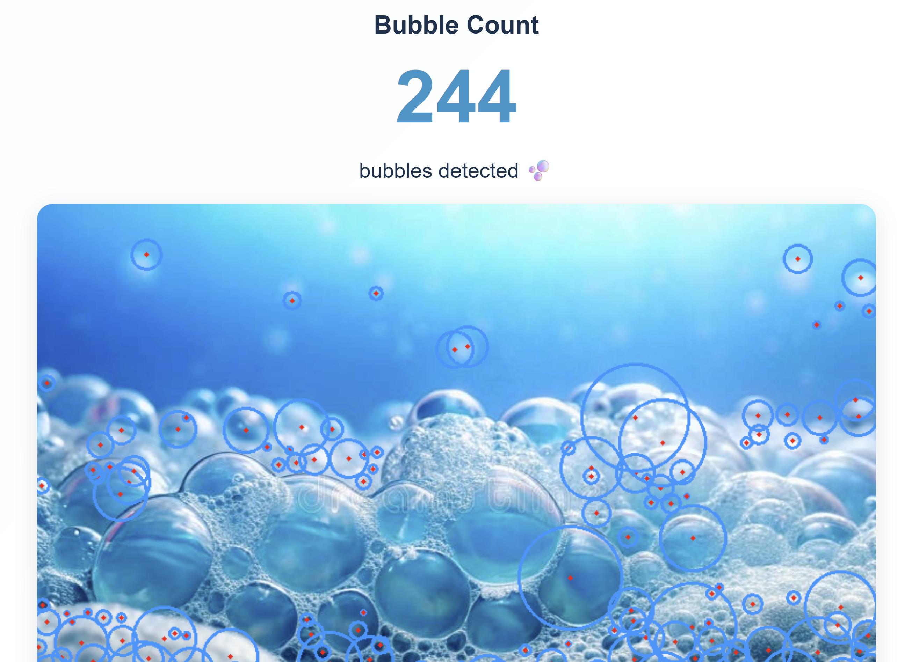

# Useless Bubble Counter 🎯

## Basic Details
### Team Name: Brainwave

### Team Members
- Team Lead: Ashika Jojo - Govt. Model Engineering College
- Member 2: Anamika N - Govt. Engineering College

### Project Description
An overly complex digital tool designed to manually or automatically count individual bubbles appearing on a screen or popping in liquid. It provides high-precision analytics and real-time counts for an utterly pointless metric.

### The Problem (that doesn't exist)
Humanity has spent centuries staring at carbonated drinks, soap suds, and bubble wrap without ever knowing the *exact* number of bubbles in existence at any given millisecond. The lack of bubble data is an unaddressed tragedy of modern science.

### The Solution (that nobody asked for)
A dedicated app that counts bubbles, logs popping statistics, and gives you deep analytical insights into your bubble-popping efficiency—because why enjoy bubbles when you can turn them into raw numerical data?

## Technical Details
### Technologies/Components Used
For Software:
- HTML5, CSS3, JavaScript
- Frameworks: React / Tailwind CSS
- Tools: VS Code, Git, GitHub
### Screenshot 1 – Project Development




### Screenshot 2 – Project Interface




### Screenshot 3 – Running Application



### Implementation
For Software:
# Installation
```bash
git clone [https://github.com/your-username/useless-bubble-counter.git](https://github.com/your-username/useless-bubble-counter.git)
cd useless-bubble-counter
npm install